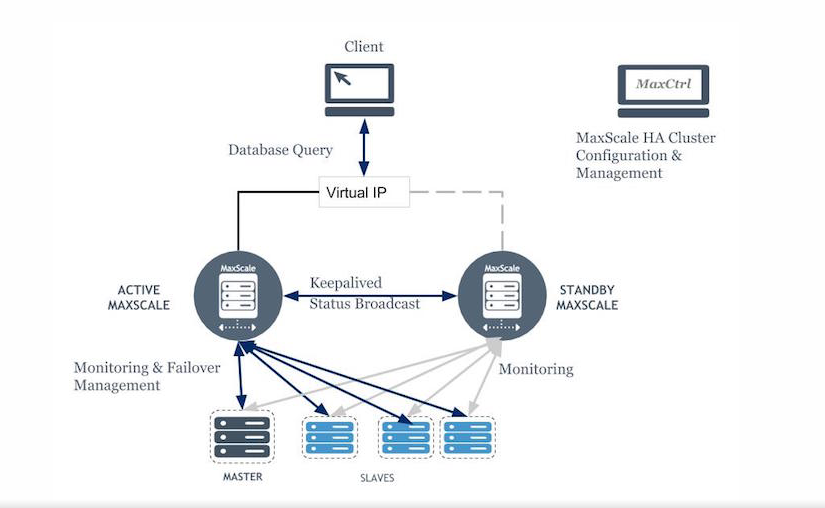

# Maxscale Helm

A containerized software-based routing solution to mariadb galera clusters. This is a containerized setup of Maxscale loadbalancing cluster topology (2 instances as master/backup using keepalived for failover). Refer diagram in Section II below.

## I. Requirements:

Startup mariadb cluster and optional namespace. Refer this [Confluence Page](https://confluence.sb1.sil.net:8444/pages/resumedraft.action?draftId=31391885&draftShareId=2cbf1032-f894-42ed-97ac-4a433503e823&).


## II. Quick Start

1. Build the docker file
    ```bash
    # build the image
    docker build -t youruser/maxscale-keepalived:latest .
    # upload to mirantis
    docker tag youruser/maxscale-keepalived:latest
    # login and upload to dockerhub
    docker login s
    docker push youruser/maxscale-keepalived:latest
    ```
2. Obtain Galera Cluster IPs you wish to loadbalance
    ```bash
    kubectl get all -n your-namespace
    ### Example Output:
    NAME                                       TYPE        CLUSTER-IP     EXTERNAL-IP   PORT(S)                      AGE
    service/galera-1-mariadb-galera            ClusterIP   10.96.129.73   <none>        3306/TCP                     5d15h
    service/galera-2-mariadb-galera            ClusterIP   10.96.23.75    <none>        3306/TCP                     5d15h
    ```
3. In the [values.yaml](values.yaml) file:
    a. Change Server 1 and Server2 in `maxscaleConfiguration` to match Cluster IP from Step 2  
    b. Change virtual_ipaddress in `maxscaleConfiguration` to desited Virtual IP
4. Attach to each cluster and create the following maxscale user (default: maxscaleuser) and passwords (Default: maxscaleuser12):
    For each cluster create and grant user:
    ```bash
    # on cluster 1
    create user 'maxscaleuser'@'10.96.129.73' identified by 'maxscaleuser12';
    grant all on *.* to 'maxscaleuser'@'10.96.129.73';
    # on cluster 2
    create user 'maxscaleuser'@'10.96.23.75' identified by 'maxscaleuser12';
    grant all on *.* to 'maxscaleuser'@'10.96.23.75';
    ```
4. Install using Helm 3
    ```bash
    helm3 install your-maxscale-chart-name -n your-namespace .
    ```
5. Attach to container using `maxctrl` command:
    ```bash
    kubectl get all -n your-namespace
    kubectl exec -it pod/your-maxscale-chart-name-0 -n your-namespace show-- maxctrl
    ```

## III. Other
To uninstall:
```bash
    helm3 uninstall your-maxscale-chart-name -n your-namespace
```

## IV. Topology Diagram

